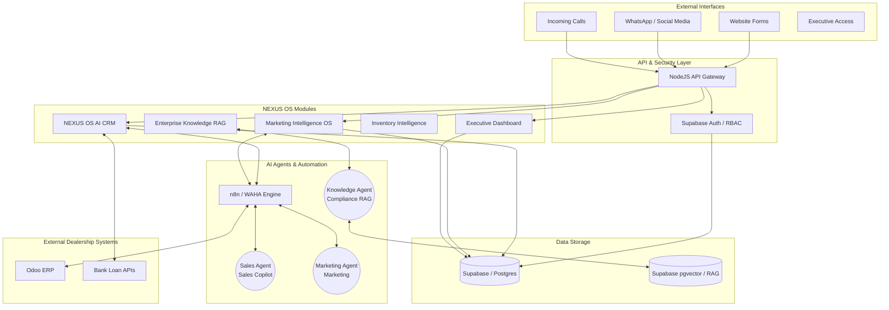

# System Architecture

## Architecture Principles
1. **Event-Driven:** Every inbound lead or CRM change triggers an event in the n8n automation engine.
2. **AI Segregation:** Specific agents handle specific domains (Sales Agent for Sales, Marketing Agent for Marketing, Knowledge Agent for Knowledge Retrieval).
3. **Single Source of Truth:** Odoo is the master for inventory; Supabase is the master for customer state and access control.
